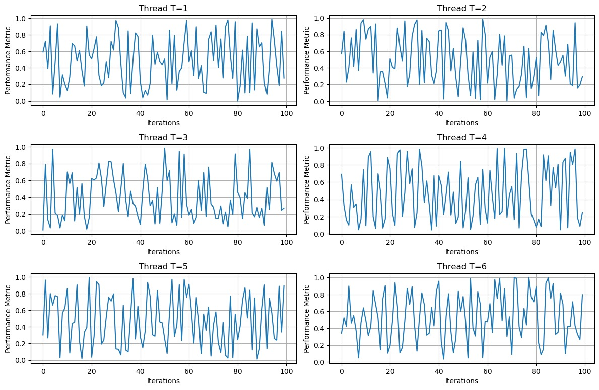
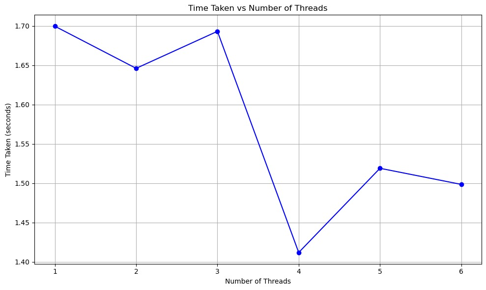
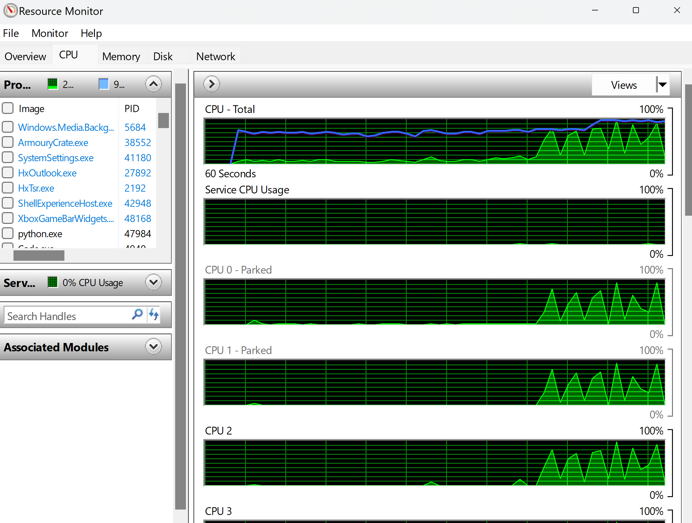
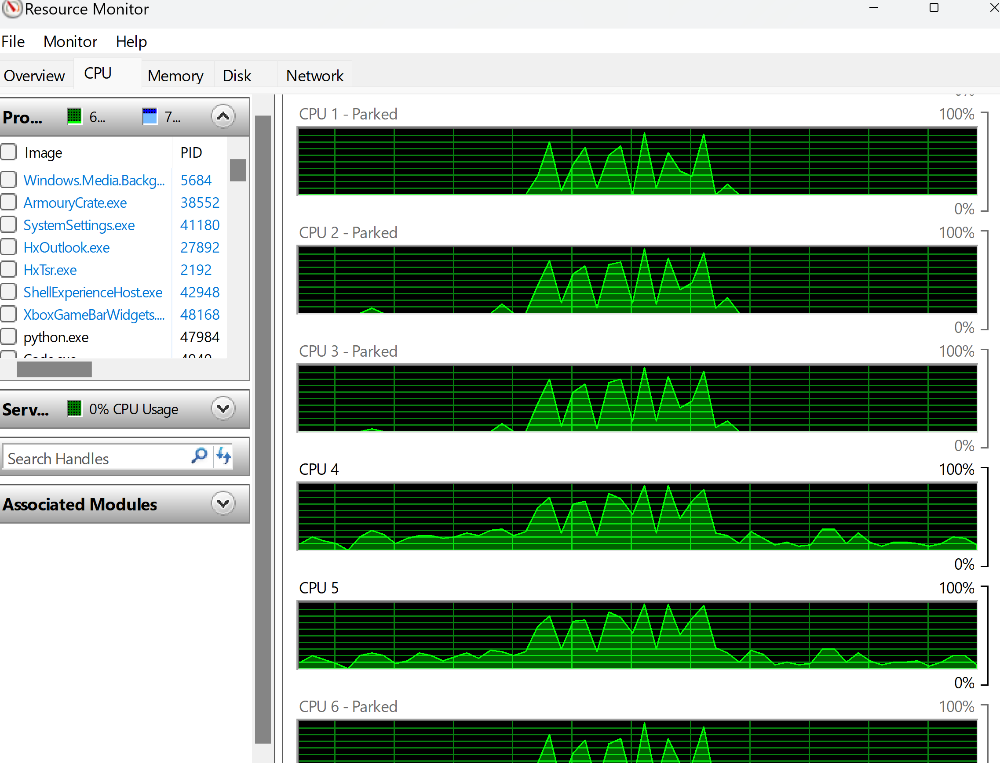
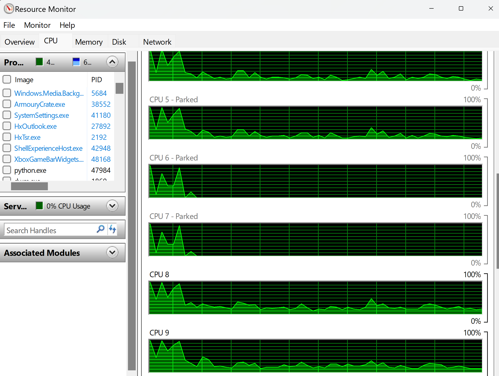

# MultiThread-102103465
# Assignment : Multiply 100 random matrices of size 1K X 1K with a constant matrix of size 1K X 1K and generate the result table, graph and CPU Usage.

## Overview :
The purpose of this project is to demonstrate the effectiveness of multi-threading in matrix multiplication tasks. Matrix multiplication is a computationally intensive operation, and parallelizing it using multiple threads can potentially improve the performance.

## Matrix Multiplication
It involves multiplying two matrices to produce a third matrix. The resulting matrix's dimensions are determined by the inner dimensions of the two input matrices. The operation is performed by taking the dot product of rows from the first matrix and columns from the second matrix.

## Methodology :
Matrix Size: Matrices of size NxN are used, where N is chosen to be sufficiently large to ensure a significant computation workload.
Constant Matrix: A constant matrix of the same size as the input matrices is generated for multiplication.
Thread Configuration: Matrix multiplication is performed using varying numbers of threads, ranging from 1 to 8.
Performance Metrics: The time taken to perform matrix multiplication with each thread configuration is measured.

## Implementation Summary
Matrix Generation: Random matrices of the specified size are generated using NumPy.
Matrix Multiplication: The matrix multiplication operation is parallelized using Python's threading module. Each thread is responsible for computing a portion of the resulting matrix.
Thread Management: Workload is divided among threads to ensure balanced computation.
Performance Measurement: The time taken for matrix multiplication with each thread configuration is recorded.
Visualization: The results are visualized using matplotlib to show the relationship between the number of threads and the time taken for matrix multiplication.

# Results :

# Graph :

# CPU USAGE :

